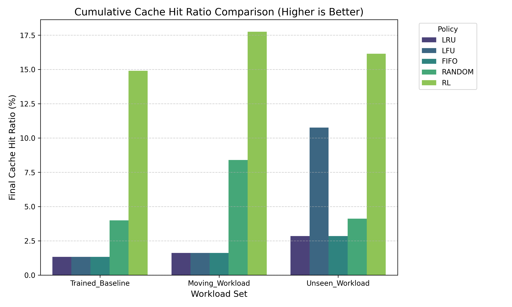
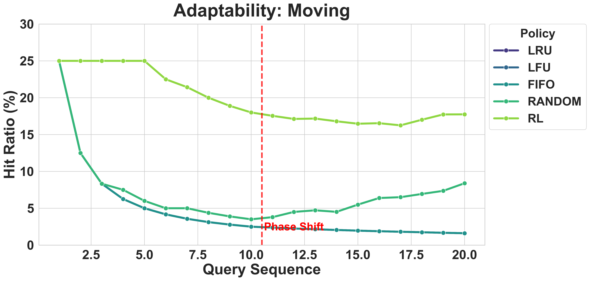
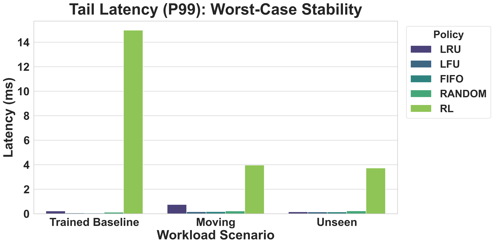
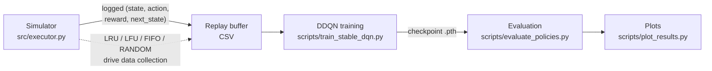

[](https://github.com/Suhasrv2403/RlCacheSpark/actions/workflows/ci.yml)

# The Cost of a Miss: RL-Driven Cache Eviction

**Suhas Ramesh Vittal** · Department of Computer Science · Golisano College of Computing and Information Sciences · Rochester Institute of Technology

A Spark-inspired cache simulator plus an offline **Double DQN** agent that learns *cost-aware* partition eviction — retaining expensive-to-recompute partitions instead of treating every cache miss the same. Against a shared query workload, the trained policy cuts **P99 latency by ~35%** versus LRU while improving hit ratio by ~12%, including on workloads it never saw during training.

**Python · PyTorch · Reinforcement Learning (DDQN) · Distributed Systems · Simulation Design**

## Results

### Hit ratio by policy



### Adapting to a workload phase shift



### P99 tail latency



*Reproduce with `scripts/evaluate_policies.py` + `scripts/plot_results.py`; exact numbers depend on your seed and simulator settings.*

## Why this matters

A cache miss on the wrong partition doesn't just slow down one query — it's the difference between a dashboard that loads in half a second and one that hangs while a customer waits. Standard cache policies like LRU treat every eviction the same, so they occasionally evict exactly the data that's most expensive to rebuild, and that's precisely what shows up as the slow, unpredictable requests users remember. By teaching the cache *which* data is costly to lose, this system targets that worst-case tail rather than just the average case — the kind of reliability improvement that shows up as fewer timeout complaints, not just a nicer-looking chart.

## Architecture



The simulator drives multiple eviction policies over synthetic query workloads to build a replay buffer; the DDQN trainer learns a Q-function offline from that buffer (see [`docs/THEORY.md`](docs/THEORY.md) for the full MDP formulation and stabilizer rationale); the trained checkpoint is loaded back into the simulator as the "RL" policy and compared against the baselines; results are plotted for analysis.

## How to run

```bash
python -m venv .venv
source .venv/bin/activate   # Windows: .venv\Scripts\activate
pip install -r requirements.txt
```

```bash
# 1. Generate replay data by driving the simulator with baseline policies
python src/executor.py

# 2. Train the DDQN policy (hyperparameters come from configs/config.yaml)
python scripts/train_stable_dqn.py --csv ../replay_buffer_cost_aware.csv --model dqn_cost_aware_net.pth

# 3. Evaluate all policies (writes results/*.csv)
python scripts/evaluate_policies.py

# 4. Generate plots from results/*.csv
python scripts/plot_results.py
```

Run tests with `pytest`; lint with `ruff check .` (CI runs both on every push/PR — see `.github/workflows/ci.yml`).

## At scale

This simulator's action space is one discrete choice per cached partition, which is fine at 5-10 slots but doesn't scale to a real cluster's millions of partitions — a production version would need a **top-K shortlist** (candidate eviction targets narrowed by a cheap heuristic first) or a **hierarchical policy** (a fast per-executor policy feeding a slower cluster-level coordinator). Training would also need to move from this offline, logged-buffer setup toward **online RL** that adapts as workloads drift, since a policy frozen at training time will degrade as query patterns change. Recomputation cost here is a simple size-proportional placeholder; a production deployment would need real lineage-derived cost estimates from the query planner.

## Repo structure

```
src/          executor.py, DataSetProcessing.py, dqn_model.py — simulator + shared DQN
scripts/      dqn_training.py, train_stable_dqn.py, evaluate_policies.py, plot_results.py, data_explore.py
tests/        pytest suite (partition mechanics, eviction, cost-aware reward)
configs/      config.yaml — training hyperparameters
data/         sample.csv — small tracked sample data
results/      policy_*.csv — tracked evaluation outputs
docs/         THEORY.md (deep dive), images/ (report figures)
```

See [`docs/THEORY.md`](docs/THEORY.md) for the full MDP formulation, experiment design, limitations, and references.
